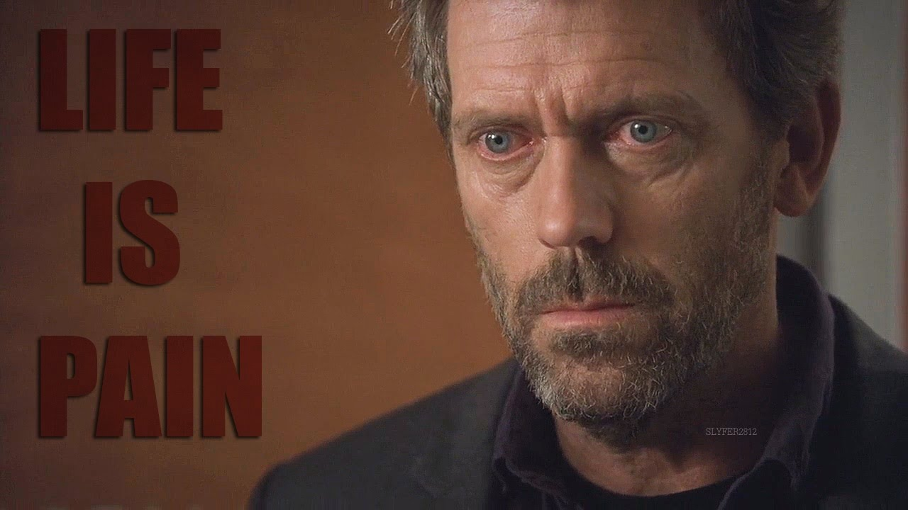

As I was working through an interesting problem statement, transpiring the vibe coding, WIFI gone out for a whole 3 minutes threw me off my trail and forced me to sit an watch the obnoxious error message "The site can't be reached". Hands tied, unable to move forward with completing what I was working on and moved on to the mobile to get distracted and quickly realized that too disconnected. With the sudden rush of dophamine coming to brake, the last minute of that ordeal gave me a wild/weird feeling about myself and the marathon of life I'm currently crawling in. Sometimes with the feeling of dophamine wearing out, makes you want to just stick to the bed and sometimes looking at the best of world/people/thing inspired to move an inch forward than before. Sometimes the co-runners are visible, helping you out, mostly willing to stomping you, switching themselves between sprint/marathon and trying to convince everyone nearby by constrantly trying to defend themselves and tire you out. When you think of the finish line, if you ever allowed by spirit of running, to take a step back to think about it thats where the fun begins.

What brings us Joy? The unsolved question riddled in my mind as I ruled out a prominent answer,Money. We can pick anything as the right answer as long as we can stand by it. No one is gonna sue us for switching the answers over the
time but wondering myself otherwise. Material ameneties, marital joys, respectbale accquintances, wandering amusements, and the list goes on!  Whats there to enjoy, anymore? If you ask this to the feet that have never touched the ground, it'll say the touch of grass.

As the time passes by, you'll want the components of life to be simpler. Instead of a complex, groundhog day, you'll expect it to be simpler. The thought of wanting a simpler day fueled the quasi-midlife crisis for me. Once I had to the sincere chance to meet [Arthur Schopenhauer](https://en.wikipedia.org/wiki/Arthur_Schopenhauer) things never made sense. Having seated against the lake and watching the urging waves trying to tell you some secrets, walking over the long striaght lines of a park and appealing to the guestling winds are still considers as somethings to bring you joy, if otherwise appaling to you.

But when you do you stop? When, to get up and start walking or to take a turn and head back to home? When do you stop making money? When do you say I have enough happiness for the moment and walk out of the zone. It's not about prioritization but about the compartmentalization of the mindset. 

source :: https://www.youtube.com/watch?v=gsNUS7PaAP0
